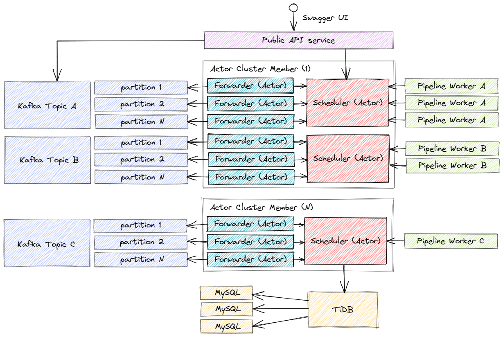

# Workload Scheduler



The Scheduler subsystem is implemented using [Proto.Actor](https://proto.actor/) based on the [Virtual Actors](https://www.microsoft.com/en-us/research/project/orleans-virtual-actors/) approach. You can read about interacting with Kafka [here](https://proto.actor/docs/local-affinity/).

This component is responsible for distributing tasks among workloads. A [Pod](https://kubernetes.io/docs/concepts/workloads/pods/) with its built-in pipeline acts as a workload.

The scheduler supports multi-tenant mode. Each client can create one or more applications. Several pipelines can be deployed within one application. Workload scaling is provided independently for each deployed pipeline.

For each pipeline, a Topic is created in a Kafka, which, in turn, is divided into several Partitions. All events from partitions are loaded using a forwarder into the scheduler of the corresponding pipeline type. The scheduler stores a dictionary of running tasks with their statuses. Dictionary with task states is saved to the [TiDB](https://github.com/pingcap/tidb) database every few seconds. Scheduler guarantees At-least-once delivery.

Workers with pipelines periodically poll the scheduler about the availability of tasks for them. When a task is executed, the worker reports the pipeline execution statuses and the result to the scheduler. All communication is done through gRPC.

An example of creating a pipeline for application:

```js
var pipeline = {
    name: 'ocr',
    chart: 'https://github.com/RyazanovAlexander/application.ocr/tree/main/chart'
};

http.post('http://localhost/api/applications/myname/pipelines', application, function(res){
    // ...
});
```

When creating this pipeline, a helm chart https://github.com/RyazanovAlexander/application.ocr/tree/main/chart will be deployed, which defines the following pipeline:

```yaml
{
  "pipeline": [
    {
      "executor": "wget",
      "commands": [
        "wget -O /mnt/pipe/image.png {{url}}"
      ]
    },
    {
      "executor": "tesseract",
      "commands": [
        "tesseract /mnt/pipe/image.png /mnt/pipe/result",
        "cat /mnt/pipe/result.txt",
        "rm /mnt/pipe/result.txt"
      ]
    }
  ]
}
```

After successfully deploying the helm chart, we can send tasks for the pipelines through the workload scheduler:

```js
var data = {
    url: 'https://some-addr.com/pic.png'
};

http.post('http://localhost/api/applications/myname/pipelines/ocr', data, function(res){
    // ...
});
```
